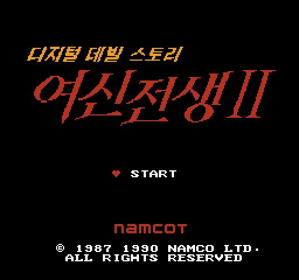
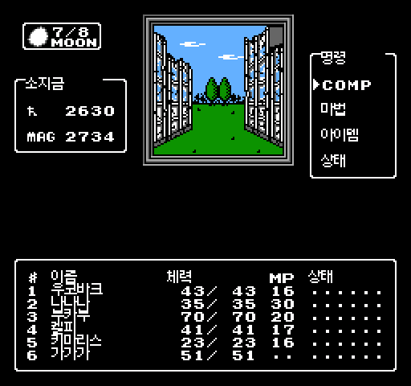
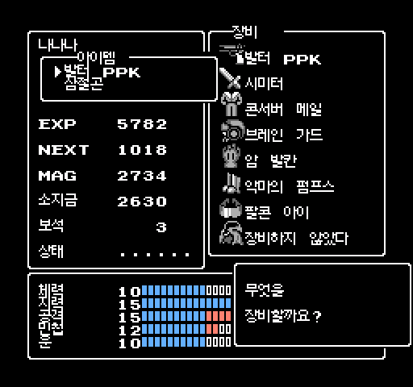

# 디지털 데빌 스토리 여신전생 II (FC) 한글 패치

  

1990년 패미컴판 『デジタル・デビル物語 女神転生II』의 **비공식 한글 패치**입니다.

> 🤖 **AI가 만든 패치입니다.** 번역, 한글 출력 코드, 버그 수정, 그리고 이 README를 포함한 문서를 모두 AI가 작성했습니다
> (초기 작업 c01~c15는 OpenAI Codex, c16 이후는 Anthropic Claude). 사람(yohankun)은 방향을 정하고 직접 플레이하며 검수했습니다.

> ⚠️ **검수가 끝나지 않았습니다 (c28).**
> - 대사·이름·메뉴·타이틀까지 **번역은 모두 끝났습니다.**
> - 제작자가 직접 플레이하며 검수한 분량은 **전체의 약 30%**입니다. 나머지는 자동 검사만 거쳤습니다.
> - 어색한 번역이나 깨진 화면을 보면 알려 주세요 → [4. 버그 제보](#4-버그-제보)

  
  

---

## 1. 패치 적용

| 항목 | 내용 |
|---|---|
| 패치 파일 | [`patch/MT2_Korean_c28.bps`](patch/) (BPS 형식) |
| 필요한 원판 | 일본판 롬 (`Digital Devil Story - Megami Tensei II (Japan).nes` 등), **524,304바이트, CRC32 `7F8D4BC6`** |
| 적용 결과 | 524,304바이트, CRC32 `E4A8C7CB`, 매퍼 19(N163) |
| 권장 에뮬레이터 | **Mesen 2** (개발·검증에 사용) |

1. 원판 롬을 준비합니다. **이 저장소에는 롬이 없고, 롬 파일은 제공하지 않습니다.**
2. BPS를 지원하는 도구로 `MT2_Korean_c28.bps`를 원판에 적용합니다.
   - [RomPatcher.js](https://www.marcrobledo.com/RomPatcher.js/) — 웹 브라우저에서 바로 됩니다(설치 없음, 휴대폰도 가능). 이 도구로 적용 결과가 맞는 것을 확인했습니다.
   - Floating IPS (Flips) — PC용
   - Lunar IPS는 BPS를 지원하지 않습니다.
3. 결과 CRC32가 `E4A8C7CB`인지 확인합니다. 해시 전체: [patch/CHECKSUMS.txt](patch/CHECKSUMS.txt)

**원판이 아니라고 나올 때:** BPS는 원판 체크섬이 다르면 적용을 거부합니다.
헤더(앞 16바이트)를 뺀 CRC32가 `10C9A789`라면 롬 내용은 맞고 헤더만 다른 것입니다.
헤더를 `4E 45 53 1A 10 20 33 10 00 00 00 00 00 00 00 00`으로 맞춘 뒤 다시 적용하세요.

**왜 IPS가 아니라 BPS인가요?** 한글을 넣으려고 롬 구조를 크게 바꿨기 때문입니다. 그래픽 256KB를 압축해 프로그램 영역으로 옮겼고, 프로그램 영역도 256KB에서 512KB로 늘렸습니다.
IPS는 「원본의 다른 위치에서 복사」를 표현하지 못합니다. 그래서 IPS로 만들면 패치 파일(565KB)에 원판 데이터가 거의 통째로 들어가고, 원본 없이도 한글판의 99%가 복원됩니다.
BPS(157KB)는 옮겨진 원판 데이터를 원본에서 복사하라고만 적습니다. 그래서 패치만으로 나오는 원판 코드는 0.1%, 그래픽 타일은 0.8%뿐입니다.
**패치에는 원판과의 차이만 담는다**는 원칙을 지키려는 선택입니다.

## 2. 처음 켤 때 — 부팅이 늦는 건 정상입니다

전원을 켜면 **약 8초 동안 초록색 화면만** 보입니다. 고장이 아니니 당황하지 마세요.
한글 글자를 그래픽 메모리(CHR-RAM)에 그때그때 올리는 구조라서, 켤 때 게임 그래픽 256KB를 전부 풀어 올리는 시간입니다.
원판보다 약 5초 늦게 오프닝이 시작됩니다.

## 3. 에뮬레이터 호환성

이 패치는 **매퍼 19(N163) + CHR-RAM 256KB** 구성입니다. 실제 N163 카트리지에는 없던 조합이라 에뮬레이터마다 지원이 다릅니다.
같은 입력을 여러 코어에 재생해 화면을 비교한 결과입니다.

| 에뮬레이터 / 코어 | 결과 | 비고 |
|---|---|---|
| **Mesen 2** (단독) | ✅ 정상 | 기준. 개발·검증에 사용 |
| Mesen (libretro) | ✅ 정상 | 롬 경로에 **한글이 있으면 파일을 못 엽니다** — 영문 폴더에 두세요 |
| FCEUmm (libretro) | ✅ 정상 | 기본 팔레트가 달라 색감이 조금 다릅니다(코어 옵션 Color Palette) |
| Nestopia (libretro) | ❌ 부팅부터 깨짐 | N163 보드의 CHR-RAM을 8KB로 고정해서 한글판을 돌릴 수 없습니다 |
| QuickNES (libretro) | ❌ 깨짐 | 대용량 CHR-RAM 미지원 |

- 깨지는 코어에서도 원판 일본어 롬은 정상으로 돕니다. 깨지는 건 한글판의 구성 때문입니다.
- 표에 없는 에뮬레이터, 실기, 플래시 카트리지(에버드라이브 등)는 확인하지 않았습니다.
- 게임 안 저장(배터리)은 Mesen `.sav`의 앞 8,192바이트가 RetroArch `.srm`과 같은 내용입니다.

## 4. 버그 제보

**문제가 있으면 Mesen 세이브스테이트 파일(`.mss`)과 함께 제보해 주세요. 고쳐 드리겠습니다.**

1. Mesen에서 문제가 생기기 **직전**(또는 이미 깨진 화면)에서 세이브스테이트를 저장합니다.
   메뉴 `File → Save State`를 쓰면 Mesen 폴더의 `SaveStates` 안에 `롬이름_번호.mss` 파일이 생깁니다.
2. GitHub **Issues**에 `.mss` 파일을 zip으로 묶어 첨부하고 아래 내용을 적어 주세요.
   - 패치 버전(c28), 쓰는 에뮬레이터
   - 무엇을 하면 어떻게 깨지는지 (예: 「장비를 바꾸고 메뉴로 돌아가면 배경에 점이 생김」)
   - 가능하면 스크린샷

세이브스테이트가 있으면 제보한 장면을 그대로 다시 돌려 원인을 추적할 수 있습니다. c27·c28의 수정도 이렇게 받은 세이브로 찾았습니다.

## 5. 알려진 문제·참고

- **한 화면에 서로 다른 한글이 31자를 넘으면** 일부 글자가 다른 글자로 보일 수 있습니다. 한글 글자를 담는 그래픽 칸이 31개뿐이기 때문입니다.
  c28에서 칸을 비우는 순서를 고쳐 31자 이하 화면에서는 생기지 않게 했습니다. 그런 화면을 보면 제보해 주세요.
- **세이브스테이트는 그래픽 메모리까지 저장합니다.** 새 버전으로 바꿀 때 옛 세이브스테이트를 불러오면 고친 화면이 반영되지 않거나 깨져 보일 수 있습니다.
  버전을 바꿀 때는 **게임 안 저장(배터리)으로 이어서** 하세요.
- 화면 맨 위·아래 한 줄의 흰 띠는 원판도 똑같습니다(TV에서는 가려지는 줄).
- 이름 입력은 한글 음절 선택판 + 영문 방식입니다.
- 악마·주문·아이템 이름은 한국어 공식판(진 여신전생 V, 녹턴 HD 리마스터, 페르소나5 로열 등)의 표기를 따랐습니다.

## 6. 수정·재배포

**누구나 자유롭게 고치고 다시 배포해도 됩니다.** 허락을 받을 필요는 없습니다. 출처를 적어 주시면 고맙겠지만 의무는 아닙니다.
단, **롬 파일이나 패치를 입힌 롬은 배포하지 말아 주세요.** 자세한 내용: [LICENSE.md](LICENSE.md)

## 7. 저작권·크레딧

- 원작: 『デジタル・デビル物語 女神転生II』 © 1987 1990 NAMCO LTD.
  이 패치는 원작의 권리자와 무관한 **비공식 팬 번역**이며, 원작 게임의 모든 권리는 원저작권자에게 있습니다.
- 이 저장소에는 롬, 원판 그래픽, 원문 대본이 없습니다. 롬 요청에는 응하지 않습니다.
- 한글 글꼴: [갈무리(Galmuri)](https://quiple.dev/font/galmuri) © quiple, SIL Open Font License 1.1 — 8×8 비트맵 타일로 변환해 패치에 넣었고, 글꼴 파일은 포함하지 않습니다.
- 번역 기준: 일본어 원문. 대조 참고: 영어 팬 번역(Pennywise v1.04), Darrman의 MT2 영어 번역 작업
- 타이틀 로고: yohankun의 목업을 바탕으로 제작
- 번역·코드·문서: AI (OpenAI Codex, Anthropic Claude) / 기획·검수: yohankun

변경 기록: [CHANGELOG.md](CHANGELOG.md)
