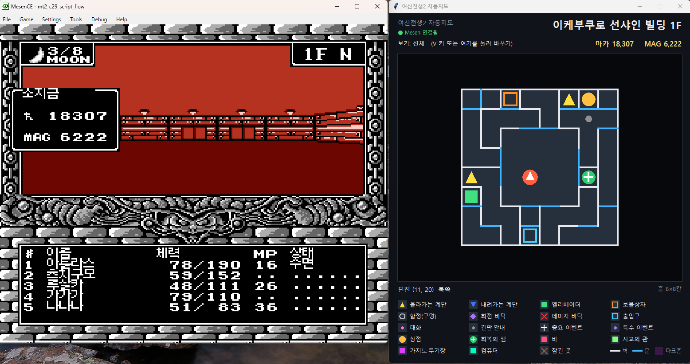
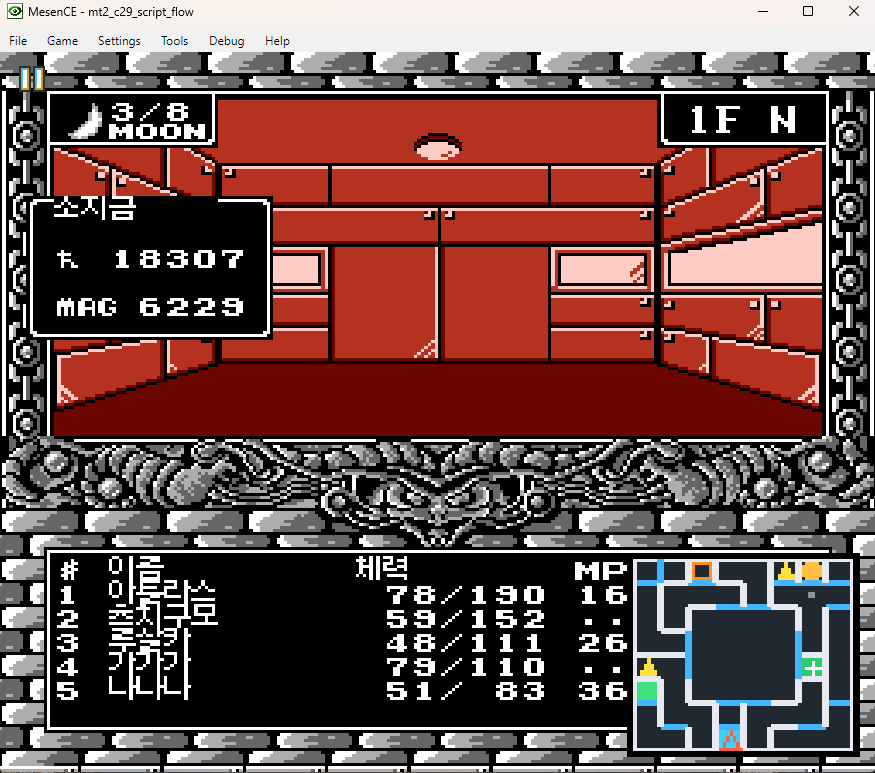
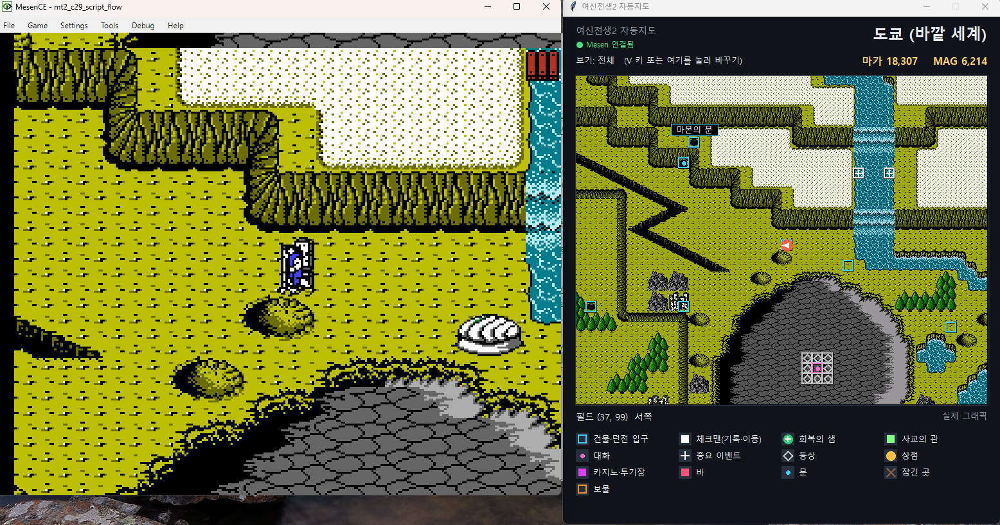
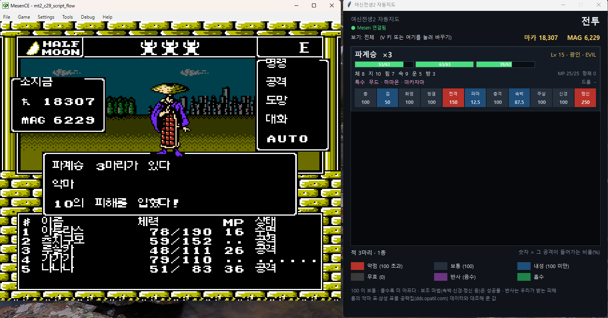

# 여신전생 II 자동지도 (Mesen 도구)

1인칭 던전 길찾기와 필드 이동을 돕는 **Mesen 2 전용 보조 도구**입니다. **롬을 고치지 않습니다.**
한글 패치판(c29)·일본 원판·영어 팬 번역판 모두에서 됩니다(지도 데이터가 같은 것을 확인).

> 🤖 이 도구와 문서도 **AI(Anthropic Claude)가 만들었습니다.** 사람(yohankun)은 직접 플레이하며 고칠 곳을 찾았습니다.

<p align="center">
  
</p>

## 두 가지 판

| 판 | 파일 | 보이는 곳 |
|---|---|---|
| **화면 겹침판** | `mt2_automap.lua` 하나 | 게임 화면 귀퉁이에 작은 지도. 설치할 것이 없습니다 |
| **별도 창판** | `mt2_bridge.lua` + `mt2_map_window.py` | 옆 창에 큰 지도·한글 범례·장소 이름, 전투 중 악마 정보, 소지금·MAG |

둘 다 **밟은 곳만 / 전체** 보기를 고를 수 있습니다.

## 화면 겹침판 — `mt2_automap.lua`

1. Mesen에서 `Debug → Script Window`를 열고 `mt2_automap.lua`를 Open한 뒤 실행(F5)합니다.
2. 키 (Mesen 창에 포커스가 있을 때)
   - `M` 켜기/끄기 · `N` 위치 바꾸기(네 귀퉁이) · `V` 밟은 곳만 ↔ 전체
3. 던전에서는 지금 층을, 필드에서는 내 주변을 칸 색으로 줄여 그립니다. **전투 중에는 저절로 숨습니다.**

<p align="center">
  
</p>

## 별도 창판 — `mt2_bridge.lua` + `mt2_map_window.py`

준비물: **Python 3** (창은 기본 포함된 tkinter로 뜹니다). 필드를 실제 게임 그래픽으로 그리려면 **Pillow**(`pip install Pillow`)와 **일본 원판 롬**이 있어야 합니다.

1. Mesen의 Script Window에서 `mt2_bridge.lua`를 실행합니다(포트 9877).
   - 「소켓을 못 불러왔다」가 나오면 Script Window 설정에서 **네트워크 접근 허용**을 켜 주세요.
2. 창을 띄웁니다. 롬은 지금 플레이하는 것과 같은 판이면 됩니다.
   ```
   python mt2_map_window.py "여신전생2 한글판.nes" --jp-rom "일본 원판.nes"
   ```
   - `--jp-rom`은 필드 실제 그래픽용입니다. 빼면 필드를 칸 색으로 그립니다(원판 롬을 첫 인자로 주면 따로 안 줘도 됩니다).
   - 순서는 상관없습니다. 창이 브리지에 알아서 다시 붙습니다.
3. `V` 키나 창 윗줄의 「보기」 글자를 누르면 밟은 곳만 ↔ 전체가 바뀝니다.
4. 창 아래에 「멈춤」이 뜨면 Mesen이 일시정지된 상태입니다(일시정지 중에는 위치가 오지 않습니다).

### 창에 나오는 것

- **지도**: 던전은 지금 층 전체를 크게, 필드는 내 주변 40×32칸을 실제 그래픽으로. 공략집 지도와 대조해 붙인 **한글 장소 이름**(88곳)과 던전 **입구 이름**.

  <p align="center">
    
  </p>

- **소지금·MAG**: 창 윗줄 오른쪽에 늘 표시됩니다(메뉴에 안 들어가도 됨).
  데빌 버스터 안에서는 게임 설정대로 데빌 버스터 쪽 마카·MAG가 나옵니다.
- **전투 중 악마 정보**: 전투가 시작되면 지도 자리에 적이 악마 종류별 카드로 나옵니다.
  - 이름·종족·성향·레벨, 마리별 HP 막대, 체·지·힘·속·운·방, MP·항체, 특수기(마법·특수 공격), 드롭 아이템과 등급
  - **상성 11칸** (총·검·화염·빙결·전격·파마·충격·속박·주살·신경·정신): 숫자는 그 공격이 들어가는 비율(%), 100이 보통.
    빨강 약점 / 회색 보통 / 파랑 내성 / 짙은 회색 무효 / 보라 반사(우리가 받는 피해) / 초록 흡수. 보조 마법은 성공률입니다.
  - 값은 사용자의 롬에서 읽습니다(악마 표·상성 표·종족 표). 공략집 데이터 244마리와 대조해 해석을 확인했습니다.

  <p align="center">
    
  </p>

## 표식

| 표식 | 뜻 |
|---|---|
| 노랑 ▲ / 파랑 ▼ | 올라가는 계단 / 내려가는 계단 |
| 초록 네모 | 엘리베이터 |
| 주황 빈 네모 | 보물상자 |
| 흰 고리 | 함정 |
| 보라 마름모 | 회전 바닥 |
| 빨강 ✕ | 데미지 바닥 |
| 하늘색 빈 네모 | 출입구 · 필드의 건물·던전 입구 |
| 분홍 점 | 대화 |
| 회색 점 | 간판 |
| 흰 + | 중요 이벤트 |
| 금색 동그라미 | 상점 (라그의 가게 포함) |
| 초록 동그라미 + 흰 십자 | 회복의 샘 |
| 자홍 꽉 찬 네모 | 카지노·투기장 |
| 흰 꽉 찬 네모 | 체크맨(기록·이동) |
| 연두 꽉 찬 네모 | 사교의 관 |
| 보라 바탕 | 다크존 |
| 흰 선 / 하늘 선 | 벽 / 문 |

## 밟은 곳 기록

- 두 판이 같은 파일 `%TEMP%\mt2_automap_seen.txt`를 씁니다. 겹침판이나 창이 켜져 있을 때만 기록됩니다.
- 처음부터 다시 하려면 이 파일을 지우세요.

## 알려진 한계

- 공략집과 대조가 안 된 층은 이름 대신 「구역 X · N층」으로 나옵니다.
- 필드 입구 이름은 던전으로 들어가는 입구에만 붙습니다(마을 안 입구 등은 이름 없음).
- 필드의 지역 경계(도쿄/마계/데빌 버스터/마을) 근처에서는 옆 지역 그림이 섞여 보일 수 있습니다.
- 이벤트 종류는 대사를 분석해 나눴습니다. 「특수 이벤트」 일부는 뜻을 다 확인하지 못했습니다.
- 전투 정보에서 번역표에 없는 무기 4개(잭나이프·청동의 검·시미터·브로드소드)의 이름은 임시 표기입니다.
- 이상한 표식을 보면 그 자리에서 세이브스테이트(`.mss`)를 남겨 제보해 주세요 → [버그 제보](../README.md#4-버그-제보)

## 파일

| 파일 | 내용 |
|---|---|
| `mt2_automap.lua` | 화면 겹침판 (지도 분류 데이터가 안에 들어 있음) |
| `mt2_bridge.lua` | 창판 브리지 — 위치·방향·소지금·MAG, 전투 중이면 적 칸을 창에 보냄 |
| `mt2_map_window.py` | 창판 |
| `mt2_demon_info.py` | 전투 정보용 롬 해석 (`python mt2_demon_info.py <롬> 102 52` 로 글로도 볼 수 있음) |
| `mt2_map_data.json` | 이벤트 종류·장소 이름 등 대사 분석·공략집 대조로 만든 분류 데이터 |
| `names/` | 악마·종족·마법·아이템 한글 이름표 |
